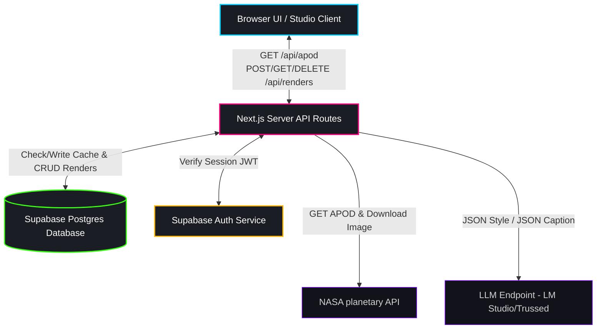
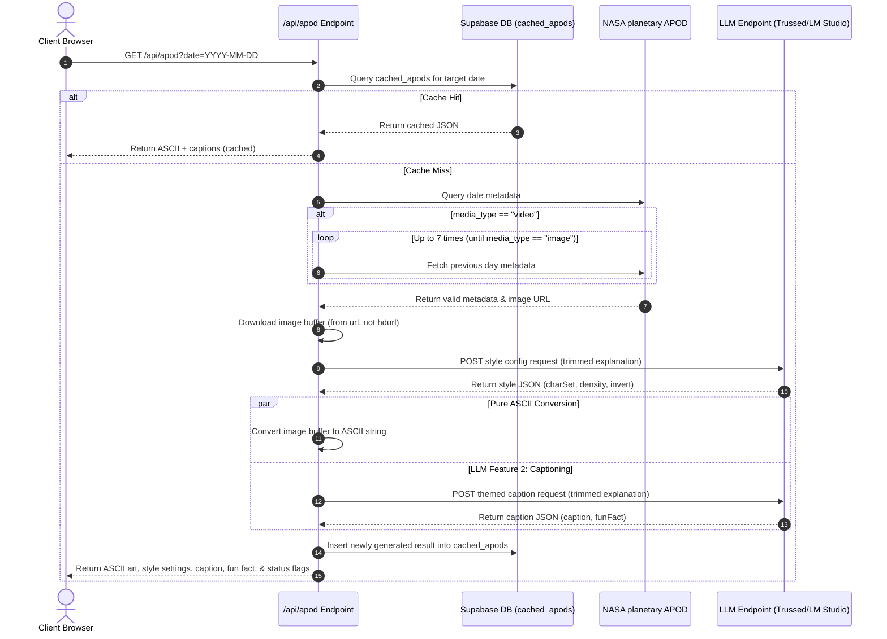
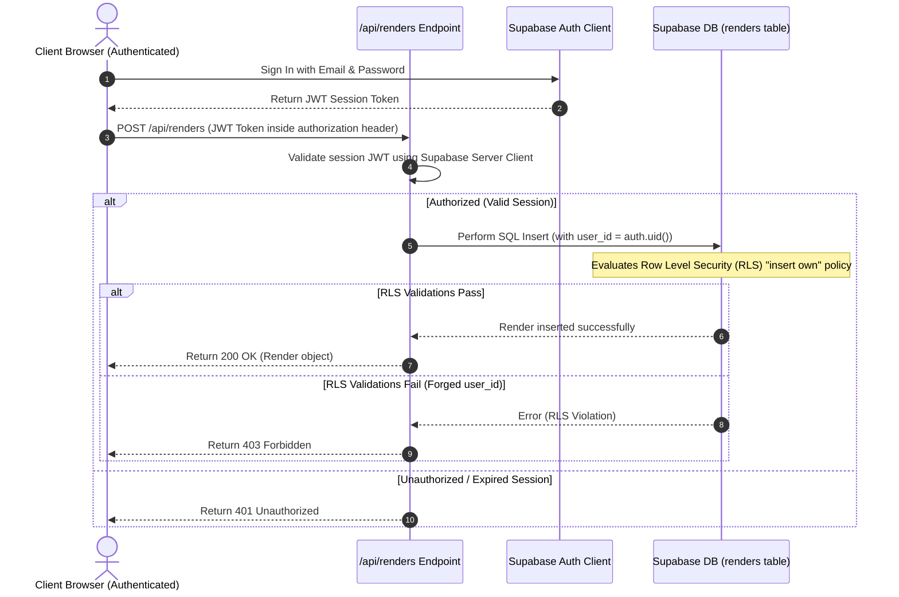
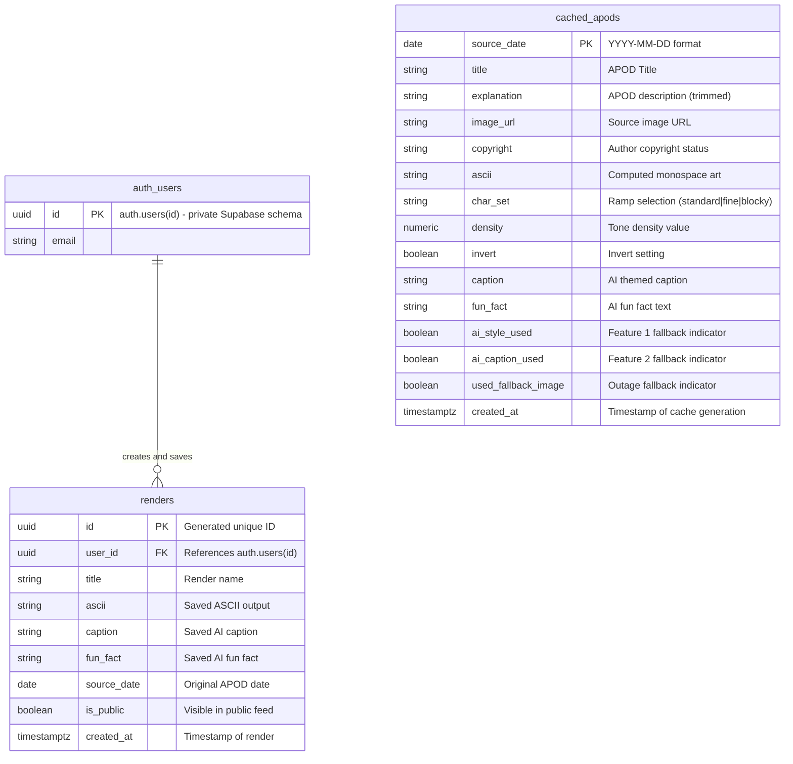

# DIAGRAMS.md -- ASCII Art Studio Diagram Spec

This document details the system design, flow control lifecycles, and database relationships of the ASCII Art Studio application.

---

## 1. High-Level System Architecture

This flow diagram illustrates the core components and communication routes between the client browser, Next.js server route handlers, Supabase services, and downstream APIs.

---

## 2. Generate APOD Lifecycle (Sequence Diagram)

Shows the orchestration of the `GET /api/apod` route. This includes the database caching check, NASA video-walkback logic, image downloading, and parallelized ASCII conversion and LLM captioning.

---

## 3. Authentication & Gallery CRUD Operations (Sequence Diagram)

Illustrates how security is maintained during read/write routes via Supabase Auth and PostgreSQL Row Level Security (RLS).

---

## 4. Entity Relationship Diagram (ERD)

Defines the database tables structure, column details, data types, and primary/foreign key relationships.

