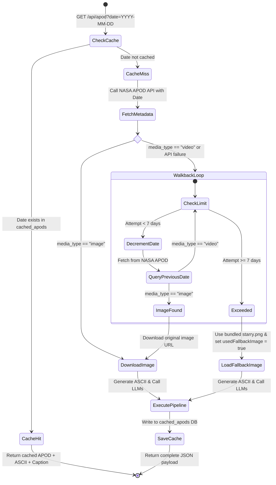
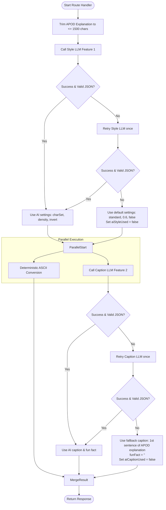
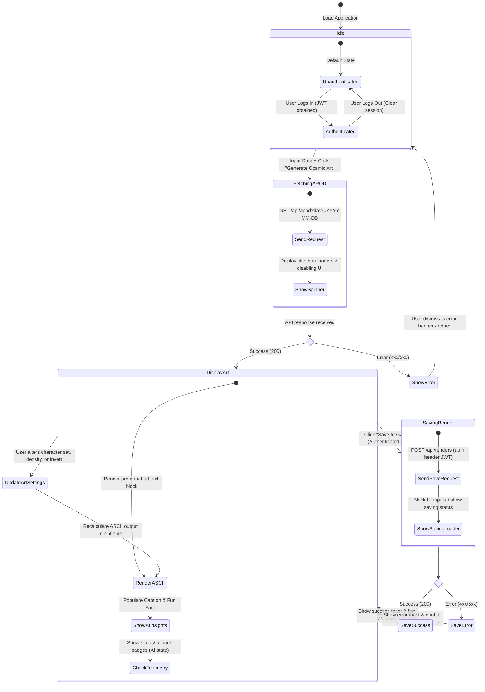
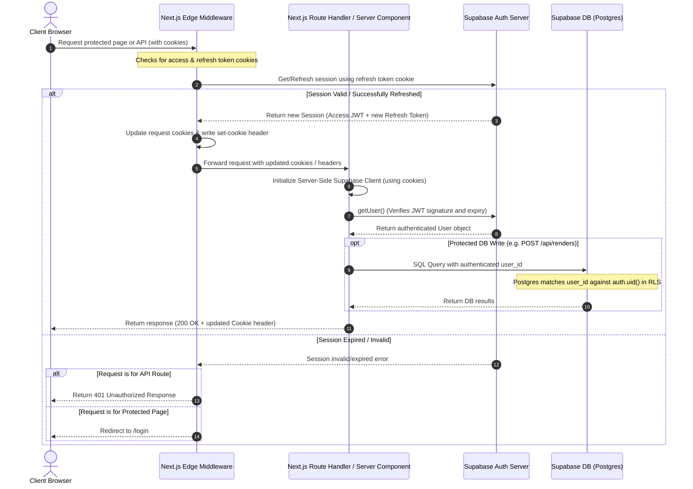

# Update DIAGRAMS.md Implementation Plan

> **For agentic workers:** REQUIRED SUB-SKILL: Use superpowers:subagent-driven-development (recommended) or superpowers:executing-plans to implement this plan task-by-task. Steps use checkbox (`- [ ]`) syntax for tracking.

**Goal:** Update `DIAGRAMS.md` with four additional Mermaid diagrams covering planned workflows and architectures.

**Architecture:** Append structured markdown sections containing Mermaid definitions to `DIAGRAMS.md`. No logic code is modified.

**Tech Stack:** Markdown, Mermaid.

## Global Constraints
- Write valid Mermaid syntax.
- Do not use placeholders or TBD sections.

---

### Task 1: Append New Diagrams to DIAGRAMS.md

**Files:**
- Modify: `DIAGRAMS.md`

**Interfaces:**
- Consumes: None
- Produces: Visual representations of APOD walkback, LLM fallback, UI state, and Supabase auth/middleware flows in `DIAGRAMS.md`

- [ ] **Step 1: Modify `DIAGRAMS.md`**

Modify [DIAGRAMS.md](file:///d:/AI%20Bootcamp/week3-cjb1077/DIAGRAMS.md) to append the four new sections at the end of the file.

```markdown
---

## 5. APOD Date Walkback & Fallback State Machine

This state diagram captures the date check, media type verification, the 7-day walkback loop, and the final fallback to a static starry image.



---

## 6. LLM Feature Execution & Fallback Flow

This flowchart illustrates the execution of the style and captioning features, retry triggers, and fallbacks.



---

## 7. Studio Dashboard UI State Flow

This state diagram captures login status, interactive controls, api fetches, and toast notification states.



---

## 8. Supabase Authentication & Middleware Session Lifecycle

This sequence diagram displays edge middleware cookie management, route-handler session token checks, and RLS checking.


```

- [ ] **Step 2: Verify syntax correctness of modified file**

Check that there are no syntax/formatting errors in the markdown and that the file builds or is clean.
Verify visually or confirm structure.

- [ ] **Step 3: Commit the changes**

Run:
```bash
git add DIAGRAMS.md docs/superpowers/specs/2026-06-28-diagrams-update-design.md docs/superpowers/plans/2026-06-28-diagrams-update.md
git commit -m "docs: add walkback, LLM fallback, UI state, and auth lifecycle diagrams to DIAGRAMS.md"
```
