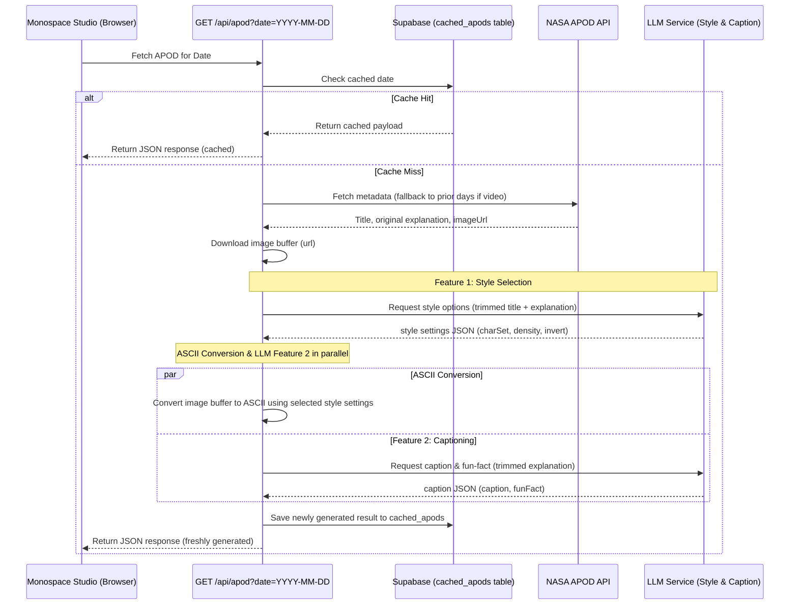

# Design Document: ASCII Art Studio

**Date:** 2026-06-28  
**Status:** Under Review  
**Author:** AI Pair Programmer (Antigravity)

---

## 1. Overview
The ASCII Art Studio is a single-page Next.js web application that fetches the NASA Astronomy Picture of the Day (APOD), converts it into ASCII art deterministically, enriches the display with two AI features (style configuration selection and themed captioning), and allows authenticated users to save their renders to a shared/private gallery.

---

## 2. Architecture & Data Flow

The application is structured as a decoupled Service-Oriented Architecture (SOA) where business logic is separated from API routes and the client components.



### 2.1 File Boundaries
*   `src/lib/nasa/apod.ts`: NASA APOD client, date walkback, and image downloader.
*   `src/lib/ascii/convert.ts`: Deterministic image buffer to ASCII string converter.
*   `src/lib/llm/client.ts` & `chat.ts`: Lower-level OpenAI-compatible API client, retry mechanisms, and JSON-mode parser.
*   `src/lib/llm/style.ts` & `caption.ts`: Prompt structures, schemas (Zod), and fallback values.
*   `src/app/api/apod/route.ts`: API route for APOD fetching and processing.
*   `src/app/api/renders/route.ts` & `renders/[id]/route.ts`: Gallery CRUD handlers.
*   `src/app/page.tsx` & `app/gallery/page.tsx`: Frontend pages.

---

## 3. Database Schema

### 3.1 Table Definitions
```sql
-- Table: public.cached_apods
create table public.cached_apods (
  source_date date primary key,
  title text not null,
  explanation text not null,
  image_url text not null,
  copyright text,
  ascii text not null,
  char_set text not null,
  density numeric(3, 2) not null,
  invert boolean not null,
  caption text not null,
  fun_fact text not null,
  ai_style_used boolean not null,
  ai_caption_used boolean not null,
  used_fallback_image boolean not null,
  created_at timestamptz not null default now()
);

-- Table: public.renders
create table public.renders (
  id uuid primary key default gen_random_uuid(),
  user_id uuid not null references auth.users(id) on delete cascade,
  title text not null,
  ascii text not null,
  caption text default '',
  fun_fact text default '',
  source_date date not null,
  is_public boolean not null default false,
  created_at timestamptz not null default now()
);
```

### 3.2 Row Level Security (RLS)
```sql
alter table public.cached_apods enable row level security;
alter table public.renders enable row level security;

-- public.cached_apods
create policy "Allow public select on cached_apods" on public.cached_apods
  for select using (true);
create policy "Allow authenticated inserts on cached_apods" on public.cached_apods
  for insert with check (auth.role() = 'authenticated');

-- public.renders
create policy "Allow select own or public renders" on public.renders
  for select using (auth.uid() = user_id or is_public = true);
create policy "Allow insert own renders" on public.renders
  for insert with check (auth.uid() = user_id);
create policy "Allow delete own renders" on public.renders
  for delete using (auth.uid() = user_id);
```

---

## 4. Error Handling & Fallbacks

We enforce a strict, user-friendly error matrix ensuring the application remains interactive and operational even when downstream APIs fail.

| Stage | Triggering Event | Fallback Strategy | API State Impact |
| :--- | :--- | :--- | :--- |
| **NASA Fetch** | Video content returned | Walkback 7 days to nearest image. | Date changes. |
| **NASA Fetch** | API offline / Rate limit | Use bundled static starry image. | `usedFallbackImage: true` |
| **Style LLM** | Fail / Timeout / Invalid JSON | Default style: `{ charSet: "standard", density: 0.6, invert: false }` | `aiStyleUsed: false` |
| **Caption LLM** | Fail / Timeout / Invalid JSON | First sentence of explanation as caption; empty fun fact. | `aiCaptionUsed: false` |

---

## 5. Testing & Verification

We use Vitest to verify all units and system components.

*   `tests/unit/ascii.test.ts`: Validates image buffer mapping to characters under different style parameters (`charSet`, `density`, `invert`).
*   `tests/unit/llm.test.ts`: Validates response parsing, parameter clamping, and fallback structures.
*   `tests/api/apod.test.ts`: Mocks the NASA endpoint to test the 7-day walkback and image downloading timeouts.
*   `tests/api/renders.test.ts`: Tests the renders CRUD endpoints and validates that unauthorized inserts/deletes are rejected.
