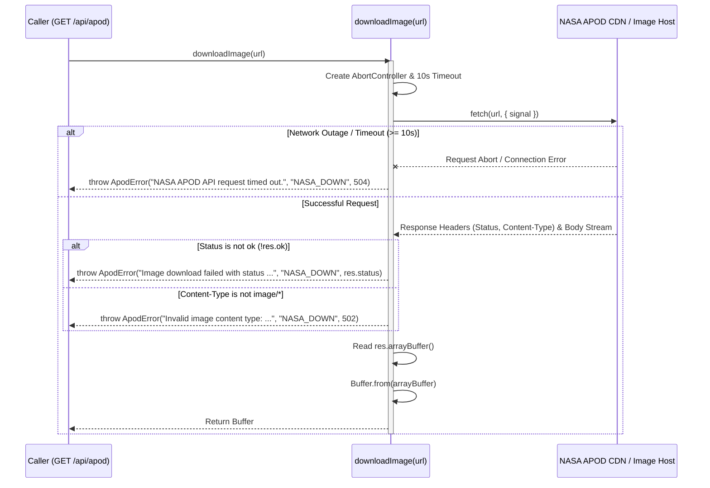

# Design Document: Image Downloader

**Date:** 2026-06-29  
**Status:** Under Review  
**Author:** AI Pair Programmer (Antigravity)

---

## 1. Overview
As part of Phase 1, Task 1.3, we need to download the target image from the NASA APOD URL on the server before passing it to the ASCII art converter. This requires a robust downloader function `downloadImage(url)` that:
- Runs only on the server.
- Implements a strict 10-second timeout.
- Verifies that the download response is successful.
- Validates that the resource content-type is a valid image type.
- Converts the payload into a node `Buffer`.

---

## 2. API Signature & Logic Flow

The function will be defined and exported in `src/lib/nasa/apod.ts`:

```typescript
export async function downloadImage(url: string): Promise<Buffer>;
```

### Flow Diagram



---

## 3. Error Mapping
We use the custom `ApodError` class with the following status codes and mappings:

- **Invalid Content-Type:** Code `"NASA_DOWN"`, Status `502` (Bad Gateway).
- **HTTP Error (e.g. 404, 500):** Code `"NASA_DOWN"`, Status matching HTTP response status code (or 502 if out of standard range).
- **Timeout (AbortError):** Code `"NASA_DOWN"`, Status `504` (Gateway Timeout).
- **Network Error:** Code `"NASA_DOWN"`, Status `502` (Bad Gateway).

---

## 4. Verification Plan

### 4.1 Automated Tests (Vitest)
We will add a new `describe("downloadImage")` block to `tests/nasa.test.ts` to cover the following:
1. **Successful Download:** Mock a fetch that returns a valid image content type (e.g. `image/jpeg`) and verify that a correct `Buffer` is returned.
2. **Invalid Content-Type:** Mock a fetch returning `text/html` or `application/json` and verify it throws an `ApodError` with code `NASA_DOWN` and status `502`.
3. **HTTP Failure:** Mock a fetch returning status `404 Not Found` and verify it throws `ApodError` with code `NASA_DOWN` and status `404`.
4. **Timeout:** Mock a fetch throwing `AbortError` and verify it throws `ApodError` with code `NASA_DOWN` and status `504`.

### 4.2 Manual Verification
We will run:
```powershell
npx vitest tests/nasa.test.ts --run
```
to verify that all unit tests pass successfully.
